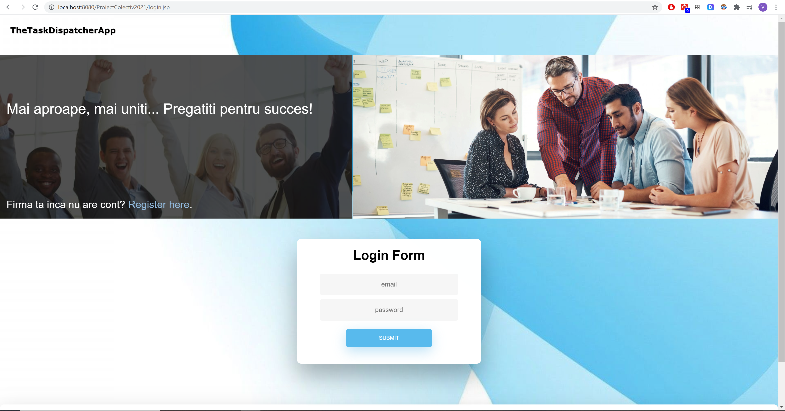
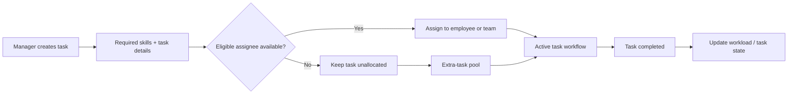
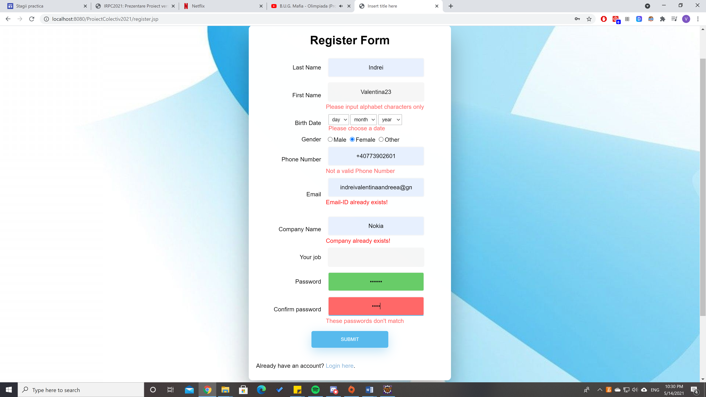
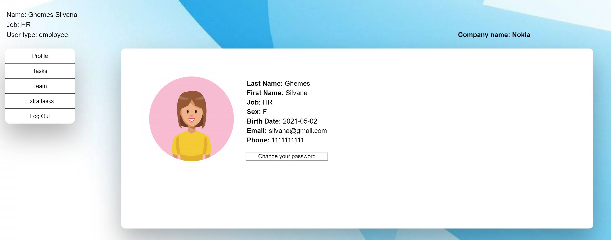
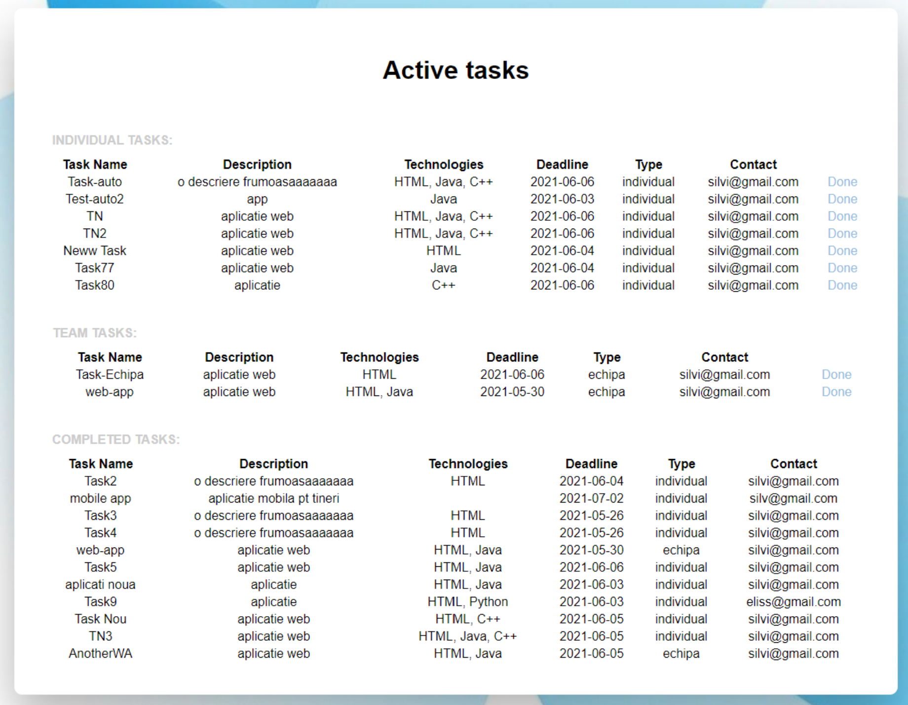
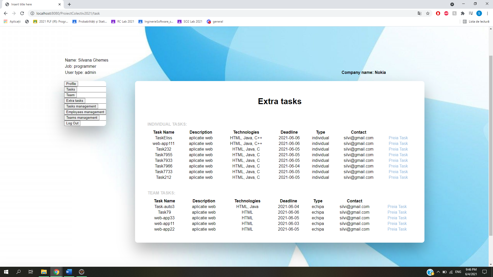
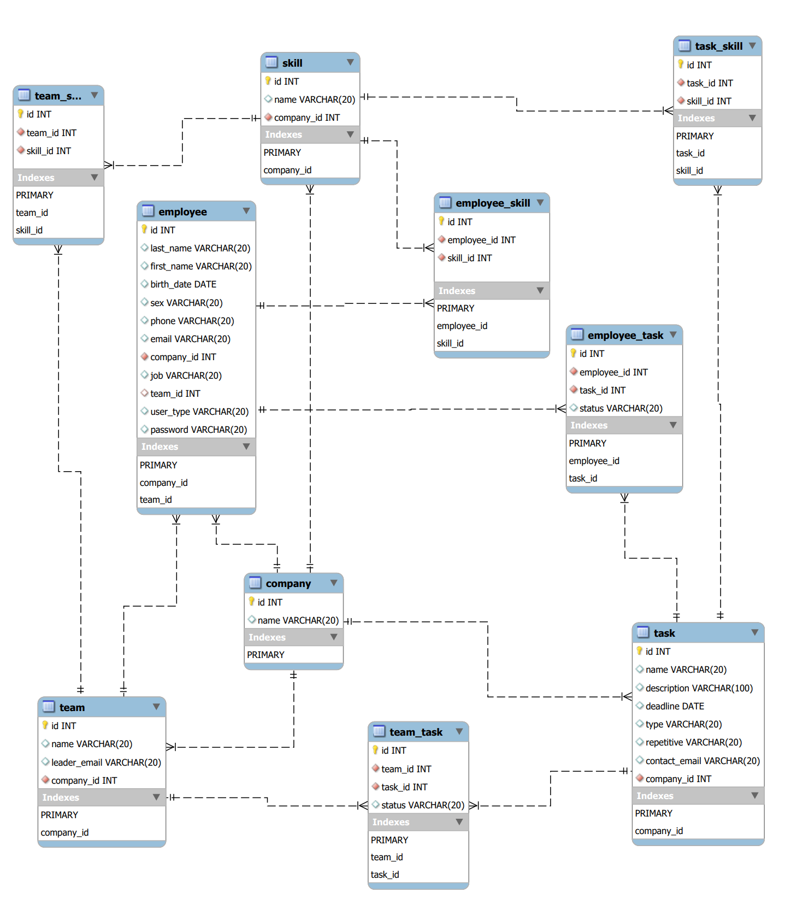

# Task Dispatcher

> Skill- and workload-aware task management for teams.

Task Dispatcher is a collaborative Java web application for managing companies, employees, teams, and tasks. The system combines role-based workflows with skill and workload constraints so that tasks can be assigned to eligible employees or teams while unallocated work remains available for later pickup.

This repository is a **portfolio case study** of my work on the project. The original collaborative source code remains unchanged in the archived team repository:

**Original source:** https://github.com/Schwarz28Iva/ProiectColectiv2021

### A small 2021 disclaimer 😄

Please excuse the very student-ish demo data — and the UI design, which was... not exactly award-winning. 😅

  

## Project overview

The application was designed around a multi-user company workflow with three main roles: **administrator, manager, and employee**. Users can manage profiles, employees, teams, and tasks through role-aware interfaces backed by a relational MySQL database.

Task creation supports required skills and assignment constraints. If an eligible assignee is available, the task can be assigned automatically; otherwise, it can remain unallocated and appear in the extra-task workflow.

## Core features

- Authentication and company registration
- Role-aware interfaces for administrators, managers, and employees
- User profile and password management
- Employee, team, and task management
- Skills associated with employees, teams, and tasks
- Individual and team task workflows
- Workload-aware assignment constraints
- Extra-task pool for unallocated work
- AJAX-based registration validation
- Generated employee credentials with email delivery
- Relational MySQL data model

## Tech stack

| Area | Technology |
| --- | --- |
| Backend | Java |
| Web layer | JSP, Java Servlets |
| Data access | JDBC |
| Database | MySQL |
| Front end | HTML, CSS, JavaScript |
| Async validation | AJAX |
| Development setup | Eclipse Dynamic Web Project |

## High-level task flow

## Interface examples

### Registration validation

The registration flow includes client-visible feedback and AJAX-backed checks for fields such as company and email availability.

  

### Profile

  

### Active tasks

  

### Extra tasks

Unallocated work can remain visible in the extra-task workflow instead of being lost when no immediate assignment is possible.

  

## Database design

The application uses a relational schema connecting users, companies, employees, teams, tasks, and skills.

  

## My contributions

I served as **team lead** and worked primarily on **front-end development and application integration**. My contributions included:

- login and registration interface work;
- AJAX-based registration validation and user feedback;
- profile-related UI and navigation;
- role-aware application layout and content presentation;
- employee, team, and task-management interfaces;
- integration work across multiple application screens;
- project planning and team coordination.

Development and integration were collaborative, so the original Git history does not map one-to-one to feature ownership.

## Source code and project history

The original project was developed collaboratively by a four-person team. To preserve that history and avoid rewriting or republishing shared source code, the original repository remains untouched and archived:

**https://github.com/Schwarz28Iva/ProiectColectiv2021**

This portfolio repository contains documentation and screenshots only.

## Notes

This project reflects the technology stack and development practices used at the time of implementation. The purpose of this repository is to document the system design, functionality, and my contribution without modifying the original collaborative codebase.

## Author

**Valentina Indrei**
